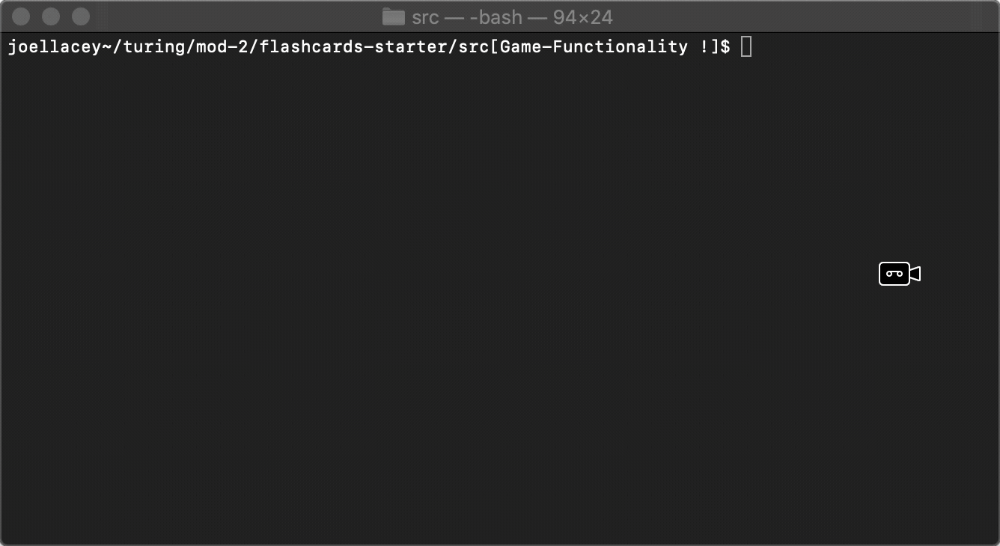
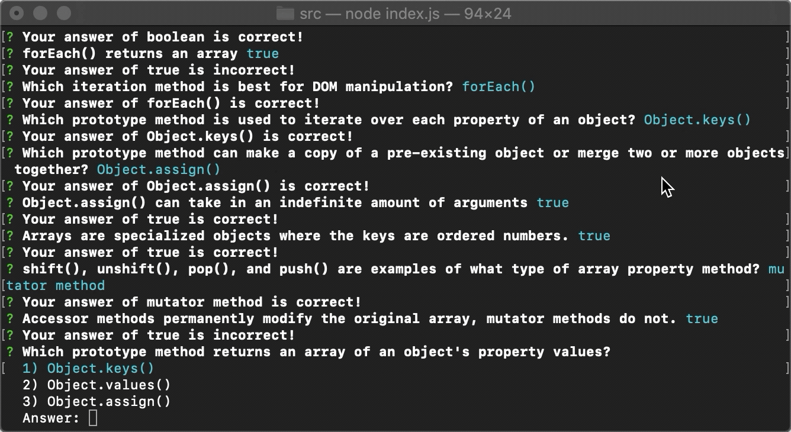

# FlashCards 

## Outline
This game allows you go run through a set of 30 flash-cards of object and array prototype questions. If you score under 90% the game restarts with any failed questions.

## Demo
Launching the game


Round restart


## Setup

Clone down the this repo. 

Once you have cloned the repo, change into the directory and install the library dependencies. Run:

```bash
npm install
```
Running `node index.js` from the root of this project should launch the game.
